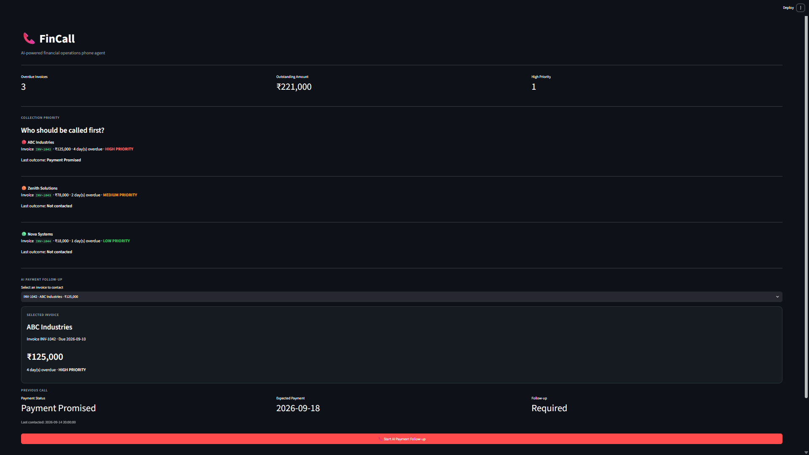

# FinCall

AI-powered financial operations phone agent built with CALL-E.

## Problem

Finance teams spend significant time manually following up with customers about overdue invoices.

## Solution

FinCall prioritizes overdue invoices and uses CALL-E to conduct AI-powered payment follow-up calls. It extracts structured payment outcomes and recommends the next finance action.

## Features

- Overdue invoice prioritization
- AI-powered outbound phone calls
- Structured payment-status extraction
- Expected payment-date extraction
- Call evidence
- Persistent call history
- Recommended next actions
- Streamlit dashboard
- CALL-E Python SDK integration

## Architecture

Streamlit Dashboard
→ FinCall Python Application
→ CALL-E
→ AI Phone Conversation
→ Structured Financial Outcome
→ Recommended Next Action

## Tech Stack

- Python
- Streamlit
- CALL-E
- Python-dotenv

## Dashboard



## Setup

```bash
git clone https://github.com/YOUR_USERNAME/FinCall.git
cd FinCall

python -m venv .venv
```

Activate the environment and install:

```bash
pip install -r requirements.txt
```

Create .env:

```bash
CALLE_API_KEY=your_api_key
```

Run:

```bash
streamlit run app.py
```

## Safety

- Never commit API credentials.
- Use only authorized phone numbers for live calls.
- Public examples use masked phone numbers.
- Live calls are explicitly initiated by the user.
